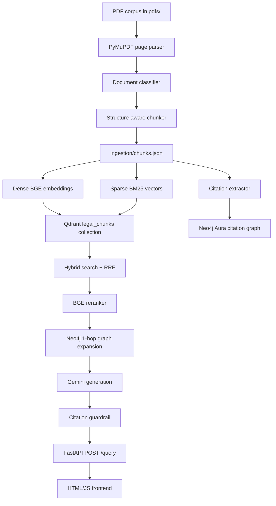

# LexScope - Legal RAG Research Assistant

LexScope is a legal and tax research assistant that answers questions from an indexed PDF corpus with grounded citations. It uses hybrid retrieval in Qdrant, citation-graph expansion in Neo4j Aura, Gemini generation, and a citation guardrail before returning answers through FastAPI and a lightweight HTML/JS frontend.

The project is designed for a zero-cost local workflow: Python runs locally, Qdrant and Neo4j can run on free hosted tiers, and Gemini free-tier keys are rotated during generation.

## Features

- Page-aware PDF parsing with PyMuPDF.
- Rule-based document classification for tax, acts, judgments, and POV documents.
- Structure-aware chunking with stable chunk IDs for idempotent re-indexing.
- Dense BGE embeddings plus sparse BM25 vectors in Qdrant.
- Neo4j citation graph using `Chunk`, `Ref`, `CITES`, and `DEFINED_IN` records.
- Hybrid retrieval with Reciprocal Rank Fusion, cross-encoder reranking, and 1-hop graph expansion.
- Gemini answer generation with model/key rotation and structured JSON output.
- Citation verification before the API returns a response.
- FastAPI backend, static frontend, CLI diagnostics, and Ragas evaluation support.

## Architecture



## Query Flow

1. A user asks a question in the frontend or sends it to `POST /query`.
2. The backend searches Qdrant using dense and sparse retrieval with RRF fusion.
3. The top candidates are reranked with `BAAI/bge-reranker-large`.
4. Neo4j expands the context by pulling citation-linked chunks.
5. Gemini generates a structured answer using only the retrieved context.
6. The citation guardrail checks every returned citation against the exact context sent to Gemini.
7. The API returns the answer, citations, confidence, insufficient-context flag, and retrieved chunk IDs.

## Tech Stack

| Layer | Technology |
| --- | --- |
| Language | Python 3.10+ |
| PDF parsing | PyMuPDF |
| Vector search | Qdrant Cloud or local embedded Qdrant |
| Graph database | Neo4j AuraDB |
| Embeddings | `BAAI/bge-large-en-v1.5` |
| Reranking | `BAAI/bge-reranker-large` |
| Generation | Gemini via `google-generativeai` |
| Backend | FastAPI + Uvicorn |
| Frontend | Plain HTML, CSS, JavaScript |
| Evaluation | Ragas + datasets |
| Tests | pytest |

## Project Structure

```text
app/          FastAPI app, schemas, /query and /health endpoints
evaluation/   Golden set and Ragas evaluation runner
frontend/     Static browser UI
generation/   Gemini rotation, prompts, answer generation, citation guardrail
indexing/     Qdrant setup, Neo4j setup, embeddings, sparse vectors, graph writes
ingestion/    PDF parsing, classification, chunking, ingestion orchestrator
pdfs/         Source legal and tax PDFs
retrieval/    Hybrid search, reranking, graph expansion, CLI harness
tests/        Unit and integration tests
config.py     Environment-based project settings
plan.md       Full implementation plan
design.md     Approved design and architecture decisions
```

## Setup

Run all commands from the project root.

```powershell
python -m venv venv
.\venv\Scripts\Activate.ps1
pip install -r requirements.txt
Copy-Item .env.example .env
```

Edit `.env` with your own credentials. Never commit real API keys or database passwords.

```env
QDRANT_URL=https://your-cluster.cloud.qdrant.io
QDRANT_API_KEY=your-qdrant-api-key

NEO4J_URI=neo4j+s://your-instance.databases.neo4j.io
NEO4J_USERNAME=neo4j
NEO4J_PASSWORD=your-aura-password
NEO4J_DATABASE=neo4j

GEMINI_API_KEYS=key1,key2,key3
GEMINI_MODELS=gemini-2.5-flash,gemini-2.0-flash,gemini-2.5-flash-lite
```

Notes:

- `QDRANT_URL` and `QDRANT_API_KEY` enable Qdrant Cloud.
- If Qdrant cloud variables are omitted, the app falls back to the local `qdrant_data/` path.
- Aura usually uses `NEO4J_USERNAME=neo4j`. Do not use the Aura instance ID as the database username unless your database was explicitly created that way.
- `NEO4J_USER` is also supported for local compatibility, but `NEO4J_USERNAME` is recommended.

## Docker Setup

If you prefer to run the project using Docker and Docker Compose, you do not need Python or virtual environments installed on your host.

### Prerequisites

- Docker and Docker Compose installed.
- A completed `.env` file in the project root.

### Build the Images

This command builds the backend image (which caches the BGE embedding and reranker models internally) and the Nginx frontend image:

```bash
docker compose build
```

### Ingest & Index via Docker

You can run the ingestion and indexing scripts inside the backend container. Since directories are volume-mounted, the results will be written to your host filesystem (`ingestion/chunks.json` and `qdrant_data/`):

```bash
# Ingest PDFs from pdfs/ to ingestion/chunks.json
docker compose run --rm backend python -m ingestion.run_ingest

# Index the chunks into Qdrant & Neo4j
docker compose run --rm backend python -m indexing.run_index
```

### Run the Application

Start the FastAPI backend (port 8000) and the frontend (port 5500):

```bash
docker compose up
```

Press `Ctrl+C` to stop.

- **API Health**: [http://localhost:8000/health](http://localhost:8000/health)
- **Frontend UI**: [http://localhost:5500](http://localhost:5500)

### Run Tests via Docker

Run the test suite inside the container:

```bash
docker compose run --rm backend pytest -q
```

---

## Local Setup

Run all commands from the project root.

### Step 1: Ingest PDFs (Local)

This parses PDFs from `pdfs/`, classifies each document, creates metadata-rich chunks, and writes `ingestion/chunks.json`.

```powershell
python -m ingestion.run_ingest
```

Each chunk includes:

```text
chunk_id, doc_id, doc_type, title, page_number, section_id, text
```

### Step 2: Build Indexes (Local)

This creates or updates both stores:

- Qdrant: dense and sparse vectors in the `legal_chunks` collection.
- Neo4j: citation graph for chunk-to-reference relationships.

```powershell
python -m indexing.run_index
```

The indexer uses stable chunk IDs, so rerunning it upserts existing chunks instead of duplicating them. If Qdrant embeddings and Neo4j graph data already exist, you do not need to rerun this just to start the application.

### Step 3: Run Backend (Local)

```powershell
python -m uvicorn app.api:app --reload --port 8000
```

Health check:

```powershell
Invoke-RestMethod http://localhost:8000/health
```

Expected response:

```json
{"status": "ok"}
```

### Step 4: Run Frontend (Local)

Open a second PowerShell window:

```powershell
cd frontend
python -m http.server 5500
```

Then open:

```text
http://localhost:5500
```

The frontend searches all indexed source types by default and displays the generated answer with supporting citations.

## API Usage

```powershell
$body = @{
  query = "Which military pay items are included in gross income?"
  top_k = 8
} | ConvertTo-Json

Invoke-RestMethod `
  -Uri "http://localhost:8000/query" `
  -Method Post `
  -ContentType "application/json" `
  -Body $body
```

Response shape:

```json
{
  "answer": "Generated grounded answer...",
  "citations": [
    {
      "doc_name": "Publication 3 (2025), Armed Forces' Tax Guide",
      "page": 6,
      "excerpt_id": "chunk-id"
    }
  ],
  "confidence": "high",
  "insufficient_context": false,
  "retrieved_chunk_ids": ["chunk-id"]
}
```

## CLI Diagnostics

Use the retrieval CLI when you want to inspect retrieved chunks without Gemini generation.

```powershell
python -m retrieval.cli "Which military pay items are included in gross income?"
```

Important: the CLI prints retrieval snippets only. For a final natural-language answer, use the frontend or `POST /query`.

## Evaluation

The evaluation workflow uses `evaluation/golden_set.json` and Ragas metrics for context recall, context precision, faithfulness, and answer relevancy.

```powershell
python -m evaluation.run_eval
```

The report is written to:

```text
evaluation/report.csv
```

Target quality goals from the design:

- Context recall >= 0.85
- Faithfulness >= 0.90
- 100% returned citations pass the guardrail
- Out-of-corpus questions return `insufficient_context`

## Tests

Run the full test suite:

```powershell
pytest -q
```

Quick configuration check:

```powershell
pytest tests/test_config.py -q
```

Some integration tests require valid Qdrant, Neo4j, Gemini credentials, and downloaded BGE models.

## Troubleshooting

| Problem | What to check |
| --- | --- |
| Neo4j `Unauthorized` | Confirm `NEO4J_USERNAME`, reset the Aura password if needed, and make sure the URI matches the same Aura instance. |
| Qdrant collection missing | Confirm `QDRANT_URL` and `QDRANT_API_KEY`, or omit them to use local `qdrant_data/`. |
| Frontend Ask button fails | Start Uvicorn on port 8000, then hard refresh the browser with `Ctrl + F5`. |
| CLI returns snippets instead of an answer | That is expected. The CLI is retrieval-only; use `/query` for generation. |
| Duplicate-looking retrieval results | The corpus may contain the same publication as a standalone PDF and inside a combined PDF. |
| First run is slow | BGE embedding and reranker models are downloaded and loaded on first use. |

## Design Decisions

This project intentionally stays simple operationally:

- No Docker.
- No React build step.
- No LangChain orchestration.
- No local database servers required.
- Cloud databases can be resumed when free-tier instances pause after idleness.

For the full design rationale, see `design.md`. For the phase-by-phase implementation plan, see `plan.md`.
